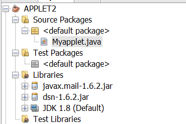
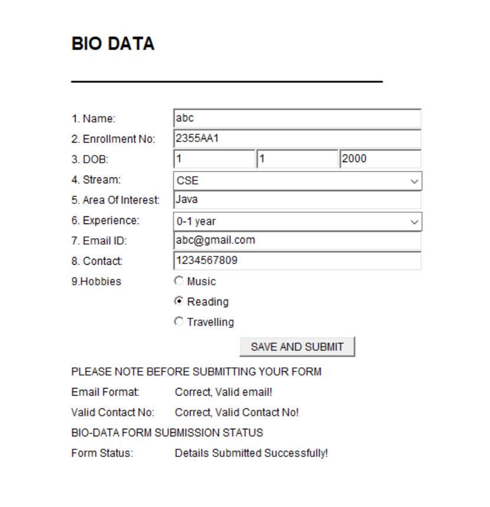
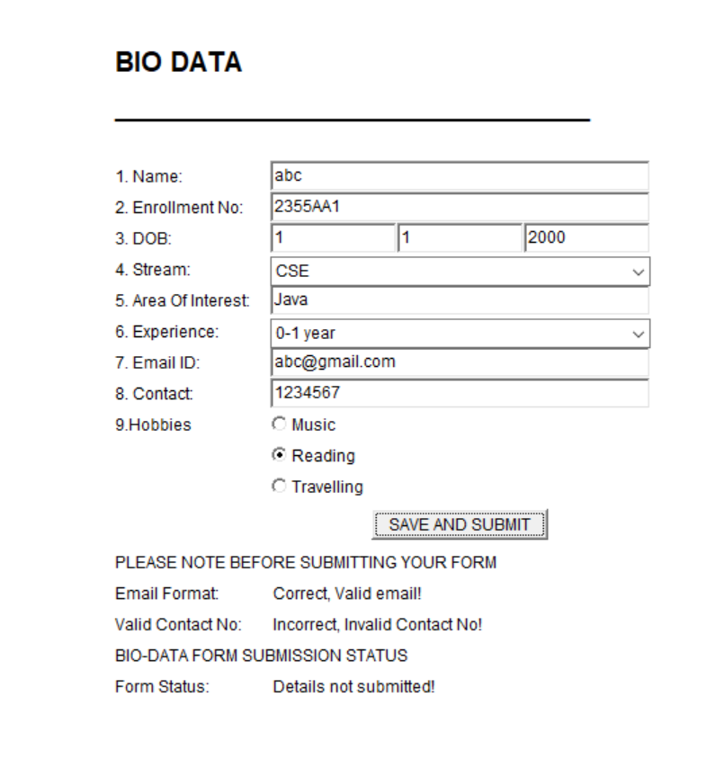
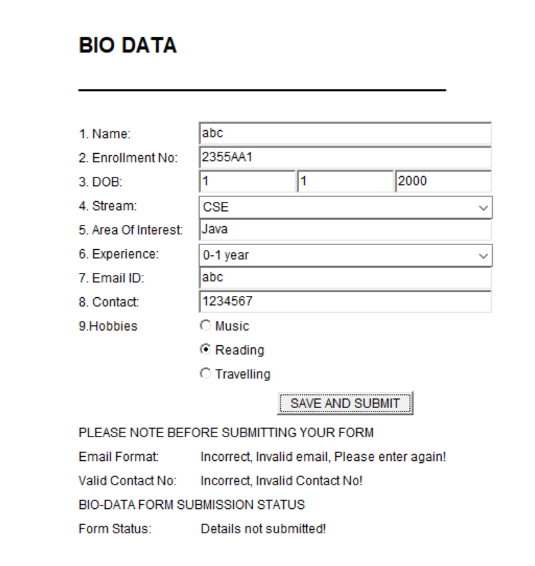
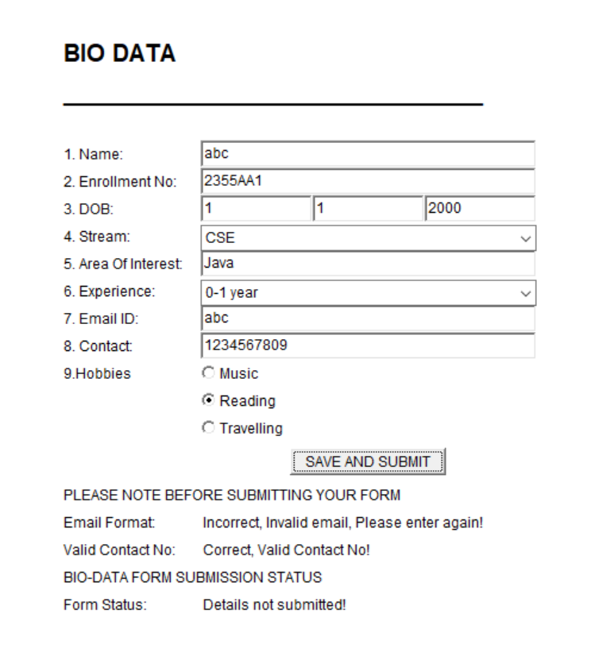

# BIO-DATA form in applet with validation of contact number

This is an example of bio-data form made using applet. In this form, you can also validate contact number and email id.

### Requirements for validating email address

Code written to validate email address will only work if two following files are added. See the project structure as well.
 
files required are:
1. javax.mail-1.6.2.jar
2. dsn-1.6.2.jar

### Output 

1. Project Structure

2. When correct details are given in form

3. When wrong details are given in form

