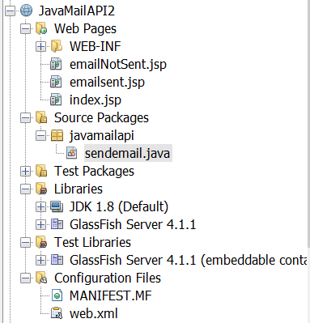
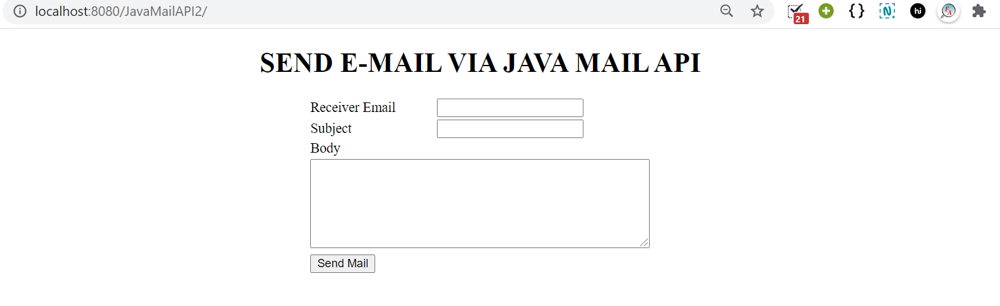
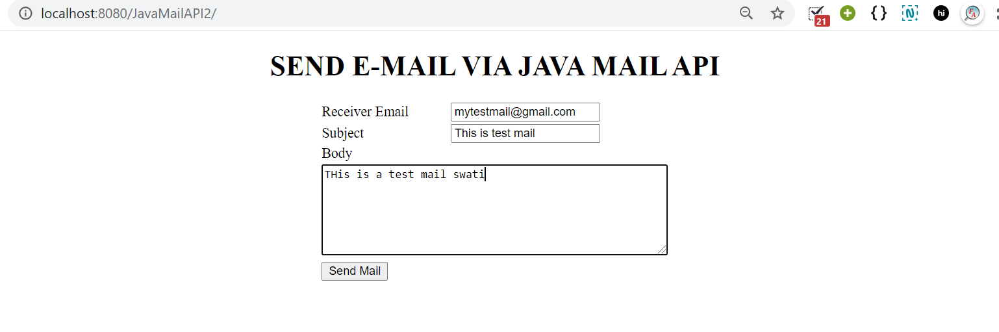
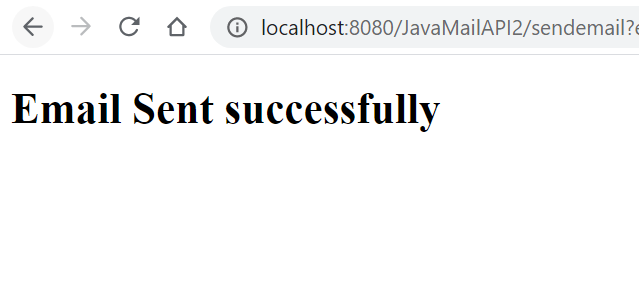
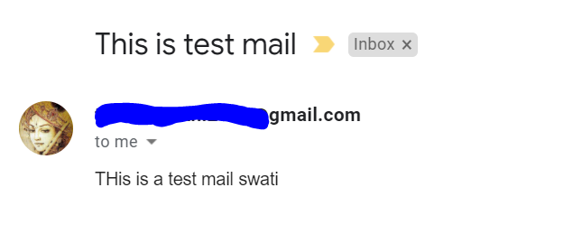
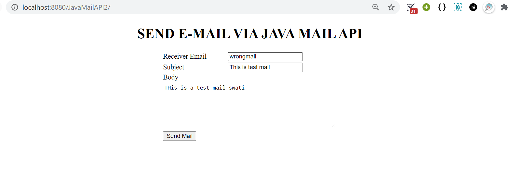
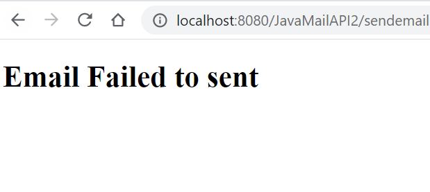

# JAVA MAIL API - JSP PROJECT EXAMPLE

In this project, the user can enter receiver's email ID, subject, body of email and then send the email using Java Mail API.

<b> Note:  Before using this project's code you need to set sender's email ID and password in </b>[sendemail.java ](/JavaMailAPI_Example/JavaMailAPI2/src/java/javamailapi/sendemail.java). Only then this code will work.
Also, remember to disable google account security incase you are using gmail id to send email and also don't forget to check that javax.mail.jar is there or not. If it is not there and an error comes then you can download it from [here](https://github.com/javaee/javamail/releases) and then add the jar file in libraries folder of your project.

## Before using this project make sure to make following changes

Due to privacy reasons, in [sendemail.java ](/JavaMailAPI_Example/JavaMailAPI2/src/java/javamailapi/sendemail.java) I have not given sender's email and password. But if you are using this project then you must update this sendemail.java  file and find following code lines there and correct it:   
> String myAccountEmail = "Write sender's email here"; 
> String password = "Write sender's password here"; 

After you have written right sender's email Id in myAccountEmail variable and right password of your sender's email Id in password variable then you are good to go. Also, make sure that you need to disable security in sender's gmail account settings also. 

### How to disable security to run this project

If you are giving your own (gmail) email id as sender's email id then,

- Go to your google account
- Go to security
- Turn on the Less secure Web App access because it is off by default.
- You are done now! 

## Project Structure 

## Main Files of this project

- [index.jsp](/JavaMailAPI_Example/JavaMailAPI2/web/index.jsp)
- [emailsent.jsp](/JavaMailAPI_Example/JavaMailAPI2/web/emailsent.jsp)
- [emailNotSent.jsp](/JavaMailAPI_Example/JavaMailAPI2/web/emailNotSent.jsp)
- [sendemail.java](/JavaMailAPI_Example/JavaMailAPI2/src/java/javamailapi/sendemail.java)

## Output [Folder](/JavaMailAPI_Example/ImageJavaMailAPI/)

### First Page that appears after running this project

### Sending email

### If receiver's email ID and your (own) sender's email ID and password are entered correct then this emailsent.jsp page will be shown. Make sure before using this project you have written right sender email ID and password in sendemail.java file.

### Receiver email ID will receive email like below :

### If receiver email is NOT entered correct then this emailNotSent.jsp page will be shown.

### Output if wrong email was entered

